# FaceSwapApp - Flowchart Dettagliato

## Schema dei flussi principali

```mermaid
flowchart TD

    MainActivity["MainActivity"]
    PhotoEditorActivity["PhotoEditorActivity"]
    PhotoEditorScreen["PhotoEditorScreen"]
    FaceSwapScreen["FaceSwapScreen"]

    MainActivity --> |"Selezione immagine\ngalleria/fotocamera"| FaceSwapScreen
    MainActivity --> |"Apre editor avanzato"| PhotoEditorActivity
    PhotoEditorActivity --> PhotoEditorScreen

    subgraph FaceSwapScreen_Flow [FaceSwapScreen]
        SelImage["Seleziona Immagine"]
        CaricaBitmap["Carica Bitmap"]
        DetectFaces["Rileva Volti (MediaPipe)"]
        ShowLandmarks["Visualizza Landmark"]
        FacePreview["Barra Preview Facce"]
        SelectFace["Seleziona Faccia"]
        DoFaceSwap["Face Swap (OpenCV)"]
        StickerOverlay["StickerOverlay"]
        StickerPicker["StickerPicker"]
        ModSticker["Modifica Sticker"]
        SaveGallery["Salva in Galleria"]
        Debug["Debug/Log"]
        ToEditor["Apri PhotoEditorActivity"]

        SelImage --> CaricaBitmap --> DetectFaces --> ShowLandmarks --> FacePreview --> SelectFace
        SelectFace --> DoFaceSwap
        SelectFace --> StickerOverlay
        StickerOverlay --> StickerPicker --> ModSticker
        ModSticker --> SaveGallery
        SelectFace --> ToEditor
        SaveGallery --> Debug
    end

    FaceSwapScreen --> FaceSwapScreen_Flow

    subgraph PhotoEditorScreen_Flow [PhotoEditorScreen]
        ViewImg["Visualizza Immagine"]
        Toolbar["Toolbar"]
        Crop["Crop (MovableCropBox)"]
        Rotate["Rotazione"]
        Filters["Filtri"]
        BgChange["Cambia Sfondo (MLKit)"]
        ObjRemove["Rimuovi Oggetto (Inpainting)"]
        SaveEd["Salva in Galleria"]

        ViewImg --> Toolbar
        Toolbar --> Crop
        Toolbar --> Rotate
        Toolbar --> Filters
        Toolbar --> BgChange
        Toolbar --> ObjRemove
        Toolbar --> SaveEd
        BgChange --> |"Segmentazione MLKit"| BgChange
    end

    PhotoEditorScreen --> PhotoEditorScreen_Flow

    subgraph Utility_Modules ["Moduli Utility"]
        ImageUtils["ImageUtils"]
        FaceSwapUtils["FaceSwapUtils"]
        OpenCVHelper["OpenCVHelper"]
        StickerData["Sticker.kt"]
    end

    FaceSwapScreen_Flow --> ImageUtils
    FaceSwapScreen_Flow --> FaceSwapUtils
    FaceSwapScreen_Flow --> StickerData
    PhotoEditorScreen_Flow --> ImageUtils
    PhotoEditorScreen_Flow --> OpenCVHelper
    PhotoEditorScreen_Flow --> StickerData

    subgraph UI_Modules ["UI/Theme"]
        Theme["Theme, Color, Shape, Type"]
        ToolbarUI["PhotoEditorToolbar"]
        CropBoxUI["MovableCropBox"]
        StickerOv["StickerOverlay"]
        StickerPick["StickerPicker"]
        FaceBar["FaceButtonsBarWithPreview"]
        FilterScreen["PhotoFilterScreen"]
    end

    FaceSwapScreen_Flow --> FaceBar
    FaceSwapScreen_Flow --> StickerPick
    FaceSwapScreen_Flow --> StickerOv
    PhotoEditorScreen_Flow --> ToolbarUI
    PhotoEditorScreen_Flow --> CropBoxUI
    PhotoEditorScreen_Flow --> FilterScreen

    MainActivity --> |"Permessi: Storage, Camera"| Permessi["AndroidManifest.xml"]
```

---

## Legenda

- **Rettangoli**: Componenti UI o funzioni principali.
- **Freccia**: Flusso di dati/eventi tra componenti.
- **subgraph**: Gruppi logici di funzionalità (editor, utilità, UI).

---

## Note principali

- Il flusso copre sia la parte FaceSwap standard (FaceSwapScreen, sticker, face detection) sia l’editor avanzato (PhotoEditorScreen).
- Le funzioni di utilità (ImageUtils, FaceSwapUtils, OpenCVHelper) sono condivise tra le varie parti dell’app.
- L’editor avanzato offre funzioni di crop, rotazione, filtri, cambio sfondo con segmentazione MLKit e inpainting/rimozione oggetto.
- Gli sticker sono posizionati in modo intelligente tramite landmark MediaPipe e matrice di trasformazione personalizzata.
- Tutti i permessi richiesti sono presenti in AndroidManifest.xml.

---